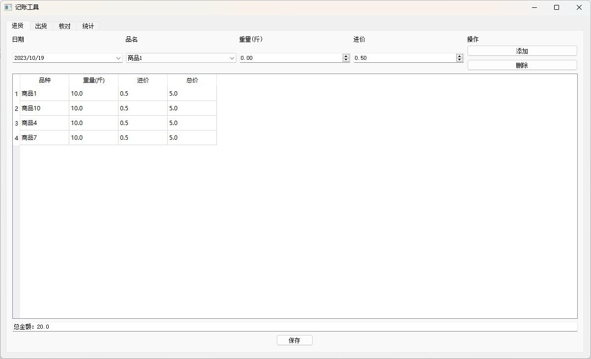
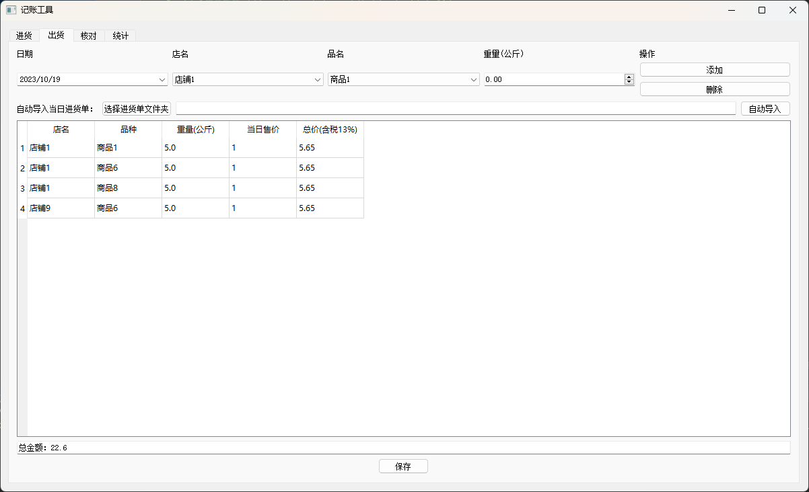
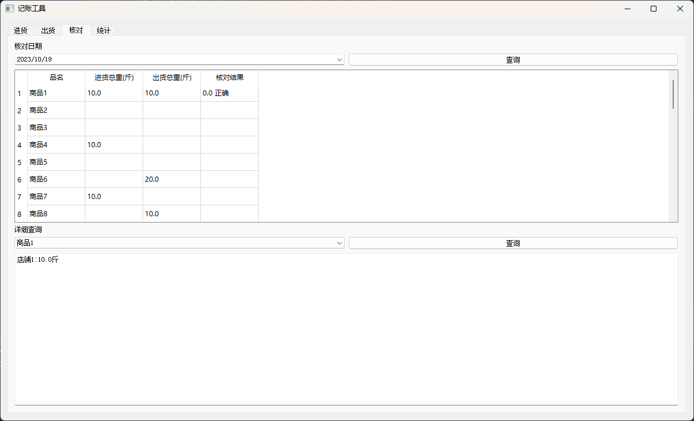
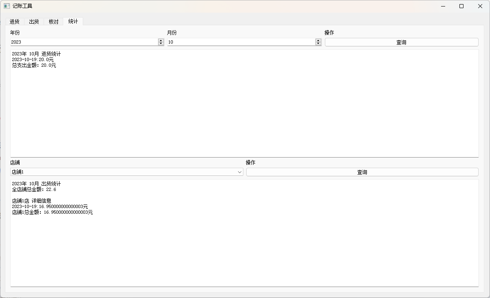

# 记帐工具
Pyside2库实现

## 参考教程
- Pyside2文档：https://doc.qt.io/qtforpython-5/
- Pyside2简易教程：https://www.byhy.net/tut/py/gui/qt_01/
- PaddleOCR：https://github.com/PaddlePaddle/PaddleOCR/tree/release/2.7
- 百度智能云-通用文字识别：https://cloud.baidu.com/product/ocr/general
- 百度智能云ak与sk获取：https://blog.csdn.net/qq_34673086/article/details/107845615

## 主要功能
- 记账
    - 进货
    - 出货
- 账单图像识别（⚡快速记账）
    - PaddleOCR
    - 百度智能云OCR
- 进出货账单核对
- 账单统计
    - 月统计
    - 店铺统计

## 环境配置
```
# Create a conda environment
conda create -y -n pyside python=3.8

# Activate the environment
conda activate pyside

# Install Pyside2 and PaddleOCR
pip install PySide2 
python -m pip install paddlepaddle -i https://mirror.baidu.com/pypi/simple  
pip install "paddleocr>=2.0.1" 

# Install dependencies
pip install -r requirements.txt
```
## 效果演示
- 进货记录
  <p align="center">
      
  <p>
- 出货记录（OCR账单批量识别）
  <p align="center">
      
  <p>
- 账单核对
  <p align="center">
      
  <p>
- 账单统计
  <p align="center">
      
  <p>
